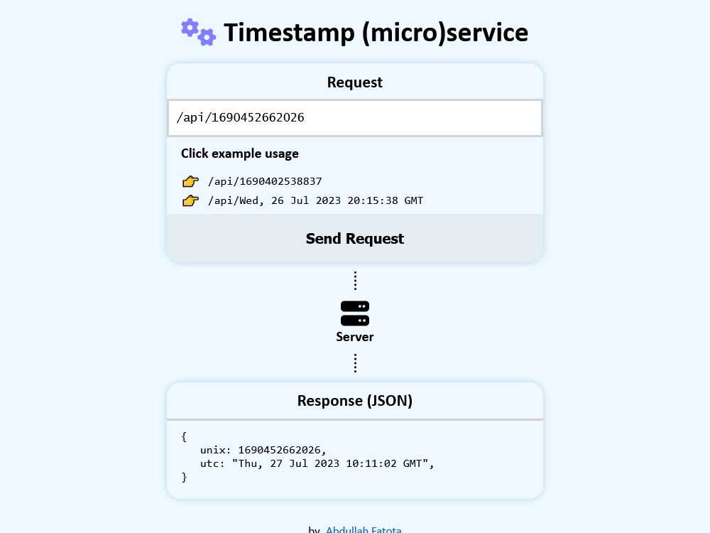

# Timestamp microservice

An API and GUI React App for it to convert date time between javascript

-   milliseconds _timestamps_ and
-   _UTC date time string_ representation of it

Example:

-   timestamp `1451001600000` and
-   date time string `Fri, 25 Dec 2015 00:00:00 GMT`

# API Usage

| call                                 | response                                              | response JSON format                                           |
| ------------------------------------ | ----------------------------------------------------- | -------------------------------------------------------------- |
| `/`                                  | run the React App (HTML)                              | not returned                                                   |
| `/api/`                              | get the JSON of current time                          | `{"unix":1690638937740,"utc":"Sat, 29 Jul 2023 13:55:37 GMT"}` |
| `/api/1451001600000`                 | get the Successful JSON of converted timestamp        | `{"unix":1451001600000,"utc":"Fri, 25 Dec 2015 00:00:00 GMT"}` |
| `/api/Fri, 25 Dec 2015 00:00:00 GMT` | get the Successful JSON of converted date time string | `{"unix":1451001600000,"utc":"Fri, 25 Dec 2015 00:00:00 GMT"}` |
| `/api/invalid-date`                  | get the Error JSON                                    | `{"error":"Invalid Date"}`                                     |

# Run the App Online

**[Run the App Online](https://timestamp-microservice-t7m9.onrender.com/)** (May take few seconds to spin up the inactive server)

# Build and Run App Locally

## Pre-dependencies

| Program         | Download link                                                    | Note                                                                                                                                                                                                          |
| --------------- | ---------------------------------------------------------------- | ------------------------------------------------------------------------------------------------------------------------------------------------------------------------------------------------------------- |
| Node.js         | [https://nodejs.org/en/download](https://nodejs.org/en/download) | Also installs `npm` package manager                                                                                                                                                                           |
| Git             | [https://git-scm.com/downloads](https://git-scm.com/downloads)   |
| (Optional) pnpm | [https://pnpm.io/installation](https://pnpm.io/installation)     | This is a different package manager used for reduced disk space when installing below packages. This is optional, the builtin `npm` will work too with below commands, Just replace `pnpm` with `npm` |

## Dependencies

| Step                                              | Terminal commands                                                | Notes                                                                                                                                                                                                                                                                                                                                                                                                                                                                                                                                                                                                                                        |
| ------------------------------------------------- | ---------------------------------------------------------------- | -------------------------------------------------------------------------------------------------------------------------------------------------------------------------------------------------------------------------------------------------------------------------------------------------------------------------------------------------------------------------------------------------------------------------------------------------------------------------------------------------------------------------------------------------------------------------------------------------------------------------------------------- |
| clone the repository or download it as `ZIP` file | `git clone https://github.com/new-AF/timestamp-microservice.git` |                                                                                                                                                                                                                                                                                                                                                                                                                                                                                                                                                                                                                                              |
| enter the directory of the now local repository   | `cd timestamp-microservice`                                      |                                                                                                                                                                                                                                                                                                                                                                                                                                                                                                                                                                                                                                              |
| install the dependencies                          | `pnpm install`                                                   |                                                                                                                                                                                                                                                                                                                                                                                                                                                                                                                                                                                                                                              |
| Run the backend server                            | `pnpm exec server/server.js`                                     | <ul><li>For npm run `npx nodemon server/server.js`</li> <li>most API calls like<ul><li><code>http://localhost:3000/api/1451001600000</code></li></ul> will work _except_ the root path<ul><li>http://localhost:3000</li><li>http://localhost:3000/</li></ul>these will **not run the React App** because they look for the `index.html` in the missing directory `dist` that is created and updated by running <code>pnpm run build</code> **each time you edit the React App** to run the most recent version.</li><li>To avoid running the build command each time, access the React App from the frontend server below.</li></ul> |
| Run the frontend server and the React App         | `pnpm run dev`                                                   | <ul><li>For npm run `npm run dev`</li><li>access the server on the show port number like so <code>http://localhost:5173/</code></li></ul>                                                                                                                                                                                                                                                                                                                                                                                                                                                                                                |
